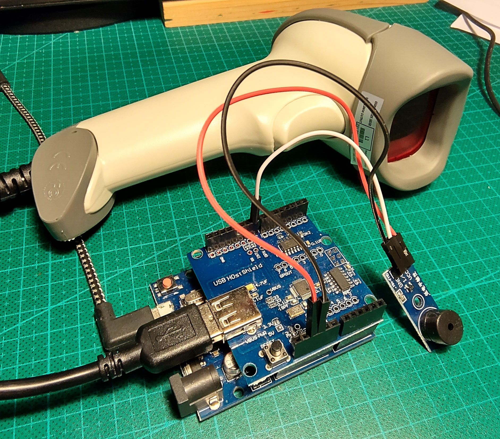
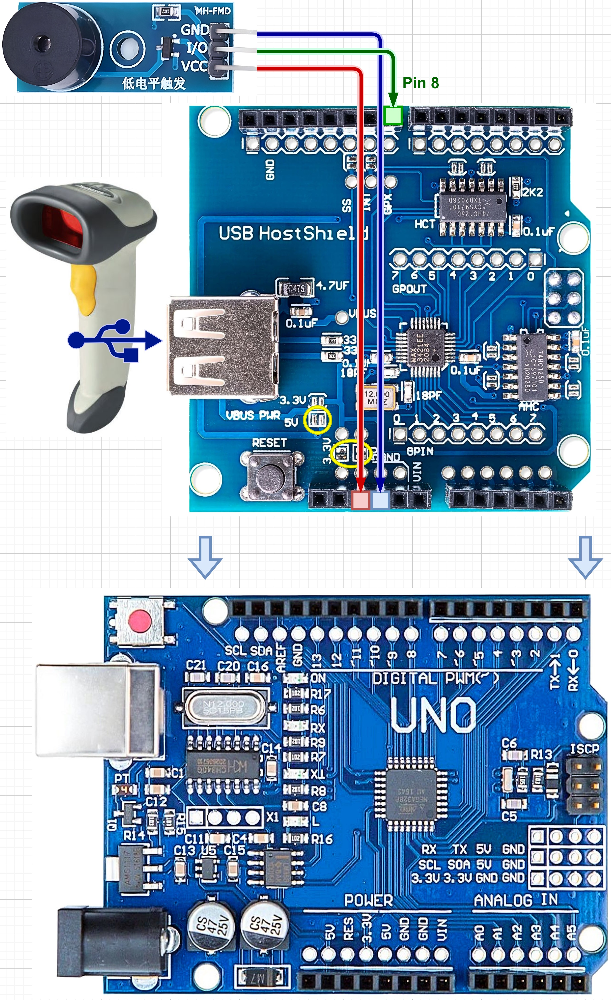

# Arduino-Quiz-Game
Device code for an Arduino based quiz game.

Use an Arduino UNO with a USB host shield installed and connect a passive buzzer module to pin 9.
You can change the pin in the source code our update the different melodies.
You will also need a USB barcode reader that uses a normal keyboard HID interface.

See [QuizGame.ino](QuizGame.ino) file for source code.

See  file for some question card examples.

[ Circuit Diagram ]

Note: some USB Host shield modules do not have the power selection jumpers configured, in such cases you should use a soldering iron to bridge the three jumper points marked by the two yellow circles, otherwise the USB device will receive no power from the shield.
